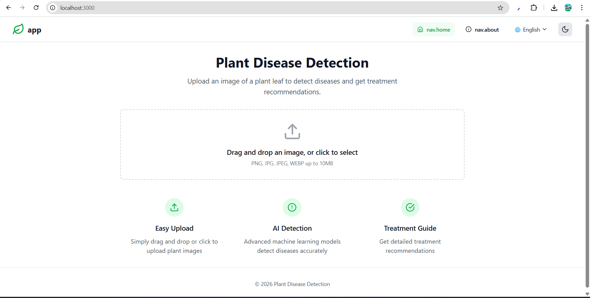
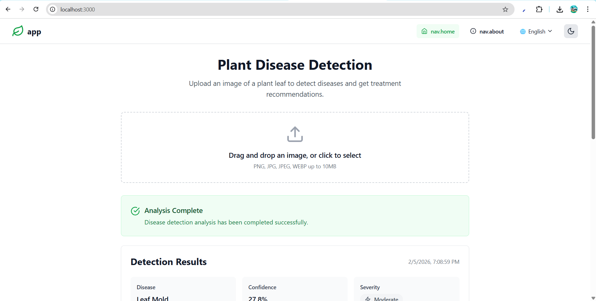
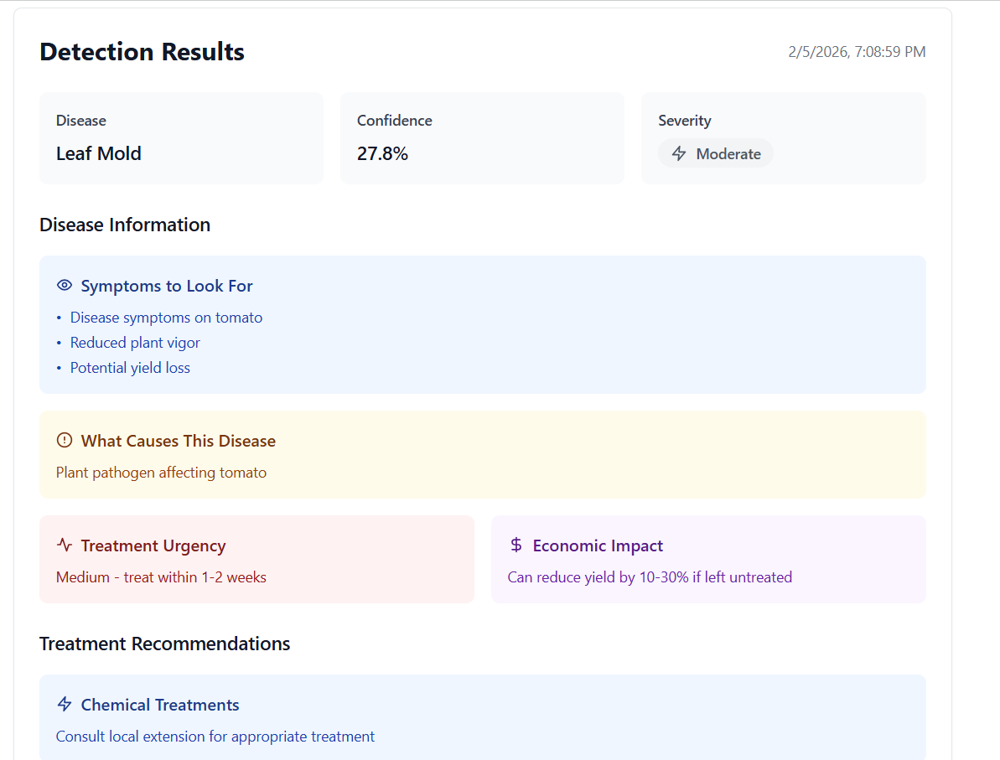
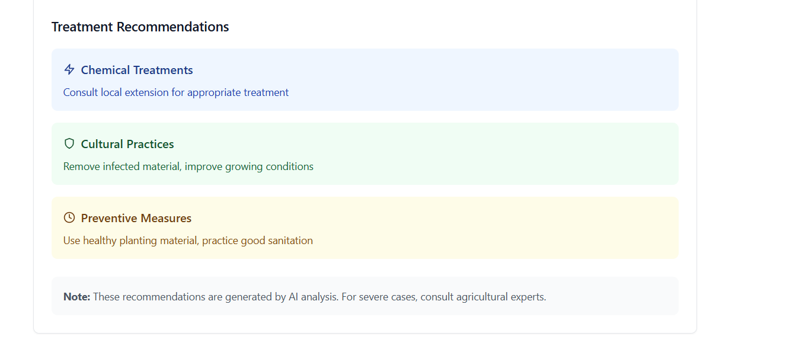
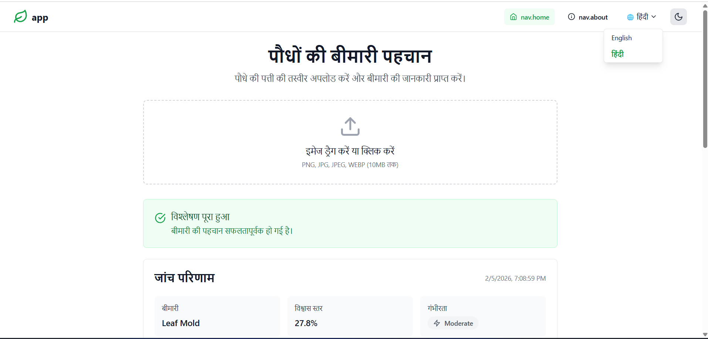
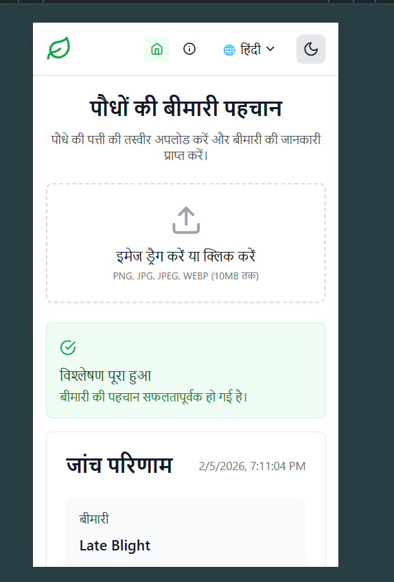

# 🌱 Plant Disease Detection using AI

An AI-powered web application that detects plant diseases from leaf images and provides treatment recommendations.
Built to help farmers, students, and researchers identify crop diseases quickly using modern AI models.

---

## 🚀 Features

* 📸 Upload plant leaf images (PNG / JPG / JPEG / WEBP)
* 🧠 AI-based disease detection using **YOLOv8**
* 📊 Confidence, severity & disease details
* 💊 Treatment recommendations:

  * Chemical
  * Cultural
  * Preventive
* 🌍 Multi-language support (i18n ready)
* 📱 Fully responsive UI
* ⚡ Hackathon-ready MVP

---

## 🛠️ Tech Stack

### Frontend

* **Next.js (App Router)**
* **React + TypeScript**
* **Tailwind CSS**
* **Lucide Icons**
* **next-intl (i18n)**

### Backend / AI

* **Python**
* **YOLOv8 (Ultralytics)**
* **FastAPI** (or Flask)
* **OpenCV**
* **Torch**

---

## 📂 Project Structure

```
├── app/
│   ├── layout.tsx        # Global layout (Header)
│   ├── page.tsx          # Home Page
│
├── components/
│   ├── Header.tsx
│   ├── ImageUploader.tsx
│   ├── PredictionCard.tsx
│
├── messages/
│   └── en.json           # Translations
│
├── types/
│   └── api.ts            # PredictionResult type
│
├── backend/
│   ├── main.py           # FastAPI server
│   └── model/
│       └── yolov8.pt
│
└── README.md
```

---

## 📸 Screenshots

### 🏠 Home Page


### 📤 Image Upload


### 📊 Detection Result


### Treatments


### Multilangual


### Responsiveness Result



## 🖼️ How It Works

1. User uploads a plant leaf image
2. Image is sent to the AI backend
3. YOLOv8 detects disease from the leaf
4. Backend returns:

   * Disease name
   * Confidence score
   * Severity
   * Symptoms
   * Treatment suggestions
5. Results are shown in a clean UI

---

## 🧪 Sample Prediction Output

```json
{
  "plant": "Tomato",
  "disease": "Leaf Mold",
  "confidence": 0.93,
  "severity": "high",
  "symptoms": [
    "Yellow spots on leaves",
    "White fungal growth"
  ],
  "causes": "High humidity and poor air circulation",
  "urgency": "Immediate treatment recommended",
  "economic_impact": "Can reduce yield up to 40%",
  "treatment": {
    "chemical": "Use approved fungicides",
    "cultural": "Improve ventilation and spacing",
    "preventive": "Avoid overhead irrigation"
  }
}
```

---

## 🧑‍🌾 Use Cases

* Farmers
* Agriculture students
* Researchers
* Smart farming systems
* Hackathons & college projects

---

## ⚠️ Disclaimer

This application provides **AI-based preliminary analysis only**.
For severe cases or commercial farming, always consult agricultural experts or local authorities.

---

## 🏁 Getting Started

### Frontend

```bash
npm install
npm run dev
```

### Backend

```bash
pip install ultralytics fastapi uvicorn opencv-python
uvicorn main:app --reload
```

---

## 🏆 Hackathon Readiness

* ✅ Clear problem statement
* ✅ AI + real-world impact
* ✅ Scalable architecture
* ✅ Farmer-friendly solution

---

## 📌 Future Improvements

* 🌐 Multi-language support (Hindi, Marathi)
* 📍 Location-based disease alerts
* 📈 Crop history tracking
* 🤖 Mobile app version
* ☁️ Cloud model deployment

---

## 🤝 Author

**Aditya Gupta**
MERN + AI Enthusiast
Built with ❤️ for smart agriculture